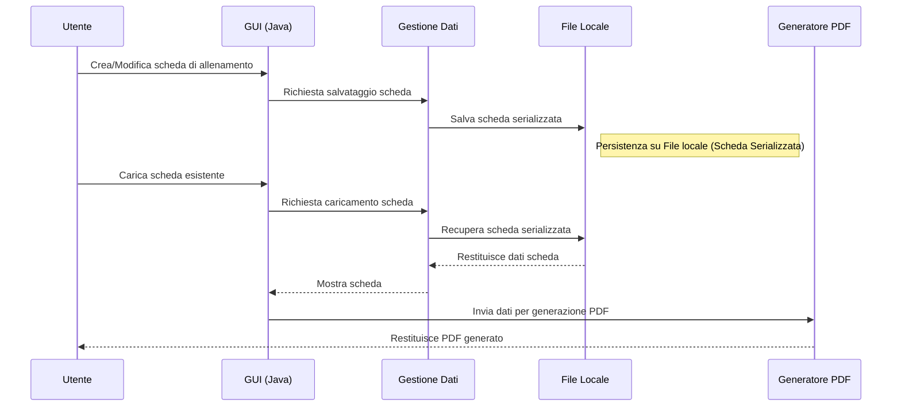

# Sistema di Gestione Schede di Allenamento per Palestre
## 1. Sommario
* [Abstract](#Abstract)
* [Introduzione](#Introduzione)
* [Architettura del sistema](#Architettura del sistema)
* [Tecnologie utilizzate](#Tecnologie utilizzate)
* [Funzionalità principali e breve panormaica del prodotto](#Funzionalità principali e breve panormaica del prodotto)
* [Risultati e test](#Risultati e test)
* [Estensioni future](#Estensioni future)
* [Conclusioni](#Conclusioni)
* [Autore](#Autore)

## 1. Abstract

Questo progetto implementa un'applicazione desktop in Java per la creazione, modifica e gestione di schede di allenamento per palestre e personal trainer.  
L'applicazione consente di generare schede in formato PDF complete di logo della palestra, informazioni personalizzate sugli atleti e programmazione degli esercizi.

L’obiettivo è fornire uno strumento semplice, veloce e personalizzabile per migliorare l'organizzazione del lavoro dei professionisti del fitness.

Il presente documento rappresenta solo una breve panormaica non tecnica di quanto sviluppato, è possibile scaricare il paper completo al seguente link:
[Link papaer tecnico](www.google.it)

Per accedere al repository del progetto completo o avere ulteriori informazioni, contattare l'indirizzo email dell'autore che si trova nella sezione ["Autore"](#Autore).

## 2. Introduzione

Nelle palestre, la gestione manuale delle schede di allenamento è ancora molto diffusa, causando:
- perdita di tempo nella stesura
- informazioni sulle schede poco chiare 
- mancanza di uniformità nella presentazione

Questo progetto propone una soluzione software, facile da usare e basata su tecnologie open source, che riduce i tempi di gestione e migliora la qualità della documentazione fornita ai clienti.

---

## 3. Architettura del sistema

L’applicazione è sviluppata in Java con interfaccia grafica (GUI) creata su Eclipse.  
Il sistema è strutturato come segue:

- **Interfaccia Utente (GUI)**: consente l’inserimento e la modifica dei dati di allenamento (informazioni atleta, esercizi con relative informazioni).
- **Gestione Dati**: strutture dati in Java per memorizzare esercizi, serie, ripetizioni e note.
- **Generatore PDF**: modulo che utilizza una libreria Java per la creazione di schede stampabili con il logo della palestra.
- **Sistema di Persistenza**: salvataggio delle schede in locale senza l'uso di DB in modo da essere più portatile e di semplice configurazione.

## 4. Tecnologie utilizzate

Di seguito verranno indicate tutte le tecnologie e le risorse che caratterizzano principalmente questo sviluppo

|COMPONENTE		|TECNOLOGIA
|----------------|-------------------------------
|  Linguaggio di sviluppo          |Java  
|IDE|Eclipse  |
|Framework| WindowBuilder|
|Generazione PDF|openPDF 2.0.3 (Libreria .jar)
|Sistema Operativo| Tutti quelli con JVM
---

## 5. Funzionalità principali e breve panormaica del prodotto
Il software permette di creare e gestire le schede di allenamento degli atleti di una palestra.
Ogni scheda presenta diverse caratteristiche comuni ad altre schede (Informazioni e logo palestra) e caratteristiche diversificate sulla base dell'allenamento personalizzato per ogni atleta.
Attualmente il prodotto permette di creare e gestire fino ad un massimo di tre giornate di allenamento per scheda senza limiti nel numero di esercizi per ognuno di essi.

Il prodotto si presenta con una veste grafica di facile intuizione e una finestra con le relative istruzioni sull'uso del prodotto e la sua configurazione.
immagine()
Tramite interfaccia grafica è possibile creare la scheda, modificare le caratteristiche di ogni esercizio inserito (ad esclusione del nome dell'esercizio), queste caratteristiche si dividono in opzionali e obbligatori:
* OBBLIGATORI
	* Numero serie e ripetizioni
	* Tempo di riposo
* OPZIONALI
	* Super serie (si/no) e con quale esercizio
	* Descrizione

Una volta creata la scheda e compilati i campi generali (Nome atleta e obiettivo scheda), è possibile generare la sua versione in pdf schematica con tanto di illustrazioni.
La scheda generata presenta:
* Nome della palestra (in alto al centro)
* Logo della palestra (in alto a destra)
* Informazioni sulla palestra come posizione geografica, codice identificativo (in alto a sinistra)
* Informazioni scheda (in alto a sinistra, sotto le informazioni della scheda)
* Elenco delle giornate di allenamento con i singoli esercizi (parte centrale)
* Informazioni sulla proprietà della scheda (in basso)

Quando viene generato il PDF viene generato automaticamente anche un file che rappresenta la stessa scheda serializzata. Questo processo permette di poter ricaricare nel software schede create in precedenza.
Accedendo in modalità modifica è possibile ricaricare il file in locale che rappresenta una scheda creata in precedenza, sarà a questo punto possibile apportare modifiche o aggiornamenti alla stessa ed effettuare un salvataggio che genererà un nuovo PDF e file di scheda serializzata.

Tramite una schermata di configurazioni è possibile definire i path che rappresentano la posizione presa in considerazione dal software per gestire:
* File di log
* Cartella di destinazione pdf generati e fonte delle immagini

Per venire in contro alle esigenze dell'utente finale è stata sviluppata un'interfaccia che spiega come effettuare la prima configurazione del software.
immagine()

Di seguito un riepilogo delle funzionalità offerte dal software:
* Interfaccia grafica con bottoni azione
* Possibilità di caricare nuovi esercizi
* Creazione nuove schede
* Caricamento e modifica schede esistenti
* Gestione scheda (Max 4 giornate)
	* Nome esercizio
	* Numero ripetizioni
	* Tempo di riposo
	* Super serie (si/no)
 * Creazione nuove schede
	* Logo palestra
	* Informazioni palestra
		 * Posizione geografica
		  * C.F.
	 * Informazioni Scheda
		  * Nome atleta
		  * Obiettivo
* Creazione nuove schede
  
| Categoria                  | Funzionalità                                                                 | Note                                                                 |
|----------------------------|-------------------------------------------------------------------------------|----------------------------------------------------------------------|
| **Interfaccia**            | Interfaccia grafica intuitiva con pulsanti azione                             | Include finestra con istruzioni d’uso                                |
| **Gestione esercizi**      | - Caricamento nuovi esercizi - Modifica caratteristiche esercizi (serie, ripetizioni, tempo di riposo, super serie, descrizione) | Il nome dell’esercizio non è modificabile                            |
| **Gestione schede**        | - Creazione nuove schede - Modifica schede esistenti - Max 4 giornate per scheda - Nessun limite esercizi per giornata | Ogni giornata può contenere un numero illimitato di esercizi         |
| **Dati palestra**          | - Logo palestra - Posizione geografica - Codice fiscale                 | Dati mostrati in intestazione PDF                                    |
| **Dati scheda**            | - Nome atleta - Obiettivo allenamento                                      | Dati riportati in intestazione PDF                                   |
| **Esportazione**           | - Generazione PDF con illustrazioni - Layout con intestazione, corpo e piè di pagina | PDF strutturato per stampa e facile lettura                          |
| **Salvataggio**            | - Creazione file scheda serializzata - Caricamento schede salvate in precedenza | Formato proprietario per garantire compatibilità con versioni future |
| **Configurazioni**         | - Impostazione percorsi per file di log, PDF generati e immagini              | Configurazione guidata disponibile                                   |
| **Guida**                  | - Istruzioni per la prima configurazione                                      | Contiene immagini illustrative                                       |
---
## 6. Risultati e test
L'utente finale si ritiene soddisfatto del risultato, la creazione delle schede risulta essere molto rapida e i tempi di esecuzione del prodotto (in tutte le sue funzionalità) sono irrilevanti (estremamente ridotti).
Viene sottolineato come il prodotto sia di facile uso e intuizione da parte dell'utente finale (utente di esperienza tecnologica media/bassa). 
A detta dell'utente finale, l'applicazione ha generato dei PDF perfettamente formattati e leggibili.
L'utente non ha avuto necessità di supporto nella configurazione iniziale del prodotto, si è basato sulla documentazione nell'apposita finestra di informazioni.

## 7. Estensioni future
In ottica futura il prodotto può essere migliorato inserendo nuove features, ad esempio;
* Archiviazione delle schede generate in un DB (es. SQL)
Questa funzionalità non è stata implementata per ridurre estremamente la configurazione e l'utilizzo del prodotto (secondo le esigenze del cliente)
* Possibilità di configurare le informazioni e il logo della Palestra che vengono inseriti nella scheda, questo darebbe la possibilità di configurazione di un unico prodotto per diverse palestre
* Possibilità di archiviazione in un DB delle immagini degli esercizi
* Possibilità di accesso in ftp a un kit di immagini standard per un pacchetto base di esercizi 

## 8. Conclusioni
Il prodotto si è dimostrato affidabile ed efficiente nel suo scopo.
L'utente ha apprezzato tutte le funzionalità messe a disposizione del software, altrettanto apprezzato è stata la tempistica di sviluppo dell'intero progetto compresa la documentazione tecnica (circa venti giorni compresi i meeting di review e le modifiche ai requisiti).

## 9. Risorse
* Possibilità di configurare le informazioni e il logo della Palestra che vengono inseriti nella scheda, questo darebbe la possibilità di configurazione di un unico prodotto per diverse palestre
* [Documentazione Java](https://docs.oracle.com/javase/8/docs/api/)
* [Documentazione OpenPdf](https://github.com/LibrePDF/OpenPDF)

## 8. Conclusioni
Il prodotto si è dimostrato affidabile ed efficiente nel suo scopo.
L'utente ha apprezzato tutte le funzionalità messe a disposizione del software, altrettanto apprezzato è stata la tempistica di sviluppo dell'intero progetto compresa la documentazione tecnica (circa venti giorni compresi i meeting di review e le modifiche ai requisiti).

## Autore
**Emanuele S.**
 
Sono un ingegnere informatico laureato con lode alla magistrale, con una solida formazione accademica e un'esperienza esperienza professionale pluriennale nel settore ICT. 
Ho lavorato su progetti complessi in ambito bancario e automotive, maturando competenze sia nello sviluppo software che nella sicurezza informatica, inoltre sono uno sviluppatore forense.
Durante la mia carriera ho sviluppato backend in Java sfruttando framework moderni come Spring Boot e Hibernate, progettando e integrando soluzioni di Identity and Access Management per garantire una gestione sicura e scalabile di ruoli, permessi e autenticazioni. Ho gestito database relazionali come MySQL e PostgreSQL, applicando metodologie Agile con team distribuiti e garantendo tempi di consegna rapidi. 
Il mio lavoro mi ha portato a collaborare direttamente con i clienti, dalla raccolta dei requisiti alla definizione delle specifiche tecniche, fino alla consegna del progetto. 
Questa esperienza mi ha permesso di affinare la comunicazione, il problem solving e la capacità di prendere in carico un progetto end-to-end, assicurando soluzioni robuste, scalabili e sicure.

**Contatti**
emanuele.sa.dev@outlook.com
