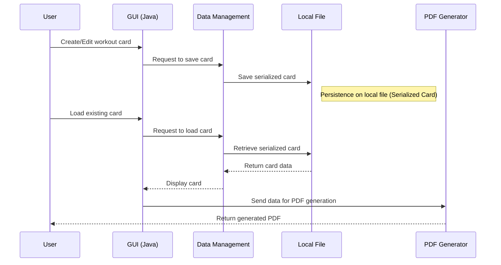

# Workout Card Management System for Gyms
## Summary
* [Abstract](#Abstract)
* [Introduction](#Introduction)
* [System architecture](#System-architecture)
* [Technologies used](#Technologies-used)
* [Main features and brief product overview](#Main-features-and-brief-product-overview)
* [Results and tests](#Results-and-tests)
* [Future extensions](#Future-extensions)
* [Conclusions](#Conclusions)
* [Author](#Author)

## 1. Abstract

This project implements a Java desktop application for creating, editing, and managing workout cards for gyms and personal trainers.  
The application allows the generation of PDF cards complete with gym logo, personalized athlete information, and exercise scheduling.

The goal is to provide a simple, fast, and customizable tool to improve the work organization of fitness professionals.

This document is only a brief non-technical overview of what was developed. The complete paper can be downloaded at the following link: 
[Technical paper link](https://github.com/EmaDev97/workout-generator-manifest/blob/main/test_paper.pdf)

To access the full project repository or for further information, please contact the author's email address found in the ["Author"](#Author) section.

## 2. Introduction

In gyms, manual management of workout cards is still very common, causing:
- wasted time in drafting
- unclear information on the cards
- lack of uniformity in presentation

This project proposes an easy-to-use software solution based on open-source technologies, which reduces management times and improves the quality of documentation provided to clients.

---

## 3. System architecture

The application is developed in Java with a graphical user interface (GUI) created in Eclipse.  
The system is structured as follows:

- **User Interface (GUI)**: allows inserting and editing workout data (athlete information, exercises with related details).
- **Data Management**: Java data structures to store exercises, sets, reps, and notes.
- **PDF Generator**: module that uses a Java library to create printable cards with the gym logo.
- **Persistence System**: saves cards locally without using a database to make the system more portable and easy to configure.

## 4. Technologies used

Below are the main technologies and resources used in this development

|COMPONENT		|TECHNOLOGY
|----------------|-------------------------------
| Development language          |Java  
|IDE|Eclipse  |
|Framework| WindowBuilder|
|PDF Generation|openPDF 2.0.3 (.jar library)
|Operating System| Any with JVM
---

## 5. Main features and brief product overview
The software allows creating and managing athletes’ workout cards in a gym.  
Each card has features common to other cards (gym information and logo) and customized features based on the athlete's personalized training program.  
Currently, the product allows creating and managing up to three workout days per card with no limit on the number of exercises for each.

The product has an intuitive graphical interface and a window with usage instructions and configuration guidelines.  
immagine()  
Through the graphical interface, you can create the card, modify the characteristics of each inserted exercise (excluding the exercise name). These characteristics are divided into optional and mandatory:  
* MANDATORY
	* Number of sets and repetitions
	* Rest time
* OPTIONAL
	* Superset (yes/no) and with which exercise
	* Description

Once the card is created and the general fields (athlete name and card goal) are filled in, it is possible to generate its schematic PDF version with illustrations.  
The generated card includes:
* Gym name (top center)
* Gym logo (top right)
* Gym information such as geographic location and ID code (top left)
* Card information (top left, under gym info)
* List of workout days with individual exercises (center)
* Card ownership information (bottom)

When the PDF is generated, a file representing the same serialized card is automatically generated. This process allows reloading previously created cards into the software.  
In edit mode, you can load a local file representing a previously created card, make changes or updates, and save it again, generating a new PDF and serialized card file.

Through a configuration screen, it is possible to define the paths used by the software to manage:
* Log files
* Destination folder for generated PDFs and image sources

To meet the end user's needs, an interface explaining the first software configuration has been developed.  
immagine()

Below is a summary of the software features:
* Graphical interface with action buttons
* Ability to load new exercises
* Create new cards
* Load and edit existing cards
* Card management (Max 3 days)
	* Exercise name
	* Number of repetitions
	* Rest time
	* Superset (yes/no)
 * Create new cards
	* Gym logo
	* Gym information
		 * Geographic location
		 * Tax code
	 * Card information
		  * Athlete name
		  * Goal
* Create new cards
  
| Category                  | Feature                                                                 | Notes                                                                 |
|---------------------------|---------------------------------------------------------------------------|----------------------------------------------------------------------|
| **Interface**             | Intuitive GUI with action buttons                                        | Includes usage instruction window                                    |
| **Exercise management**   | - Load new exercises - Edit exercise details (sets, reps, rest time, superset, description) | Exercise name cannot be modified                                     |
| **Card management**       | - Create new cards - Edit existing cards - Max 4 workout days per card - Unlimited exercises per day | Each day can contain unlimited exercises                             |
| **Gym data**              | - Gym logo - Geographic location - Tax code                        | Data shown in PDF header                                             |
| **Card data**             | - Athlete name - Training goal                                        | Data shown in PDF header                                             |
| **Export**                | - Generate PDF with illustrations - Layout with header, body, and footer | PDF designed for print and easy reading                              |
| **Save**                  | - Create serialized card file - Load previously saved cards           | Proprietary format ensures compatibility with future versions       |
| **Configurations**        | - Set paths for log files, generated PDFs, and images                    | Guided configuration available                                       |
| **Guide**                 | - First configuration instructions                                      | Includes illustrative images                                         |
---

## 6. Results and tests
The end user is satisfied with the result. Card creation is very fast, and execution times for all product features are negligible (extremely short).  
It is emphasized that the product is easy to use and intuitive for the end user (with medium/low technological experience).  
According to the end user, the application generated perfectly formatted and readable PDFs.  
The user did not require support for the initial product configuration and relied on the documentation provided in the information window.

## 7. Future extensions
For the future, the product could be improved with new features, such as:
* Storing generated cards in a database (e.g., SQL)  
  This feature was not implemented to keep configuration and usage extremely simple (according to the client's needs).
* Ability to configure the gym's information and logo inserted in the card, allowing the configuration of a single product for multiple gyms
* Ability to store exercise images in a database
* Ability to access via FTP a kit of standard images for a base set of exercises
* Ability to create more training days

## 8. Conclusions
The product proved to be reliable and efficient in its purpose.  
The user appreciated all the software features and also the development time for the entire project, including technical documentation (about twenty days, including review meetings and requirement changes).

## 9. Resources
* Ability to configure the gym's information and logo inserted in the card, allowing the configuration of a single product for multiple gyms
* [Java Documentation](https://docs.oracle.com/javase/8/docs/api/)
* [OpenPdf Documentation](https://github.com/LibrePDF/OpenPDF)

## Author
**Emanuele S.**
 
I am a computer engineer with a master's degree cum laude, with a solid academic background and several years of professional experience in the ICT sector. 
I have worked on complex projects in the banking and automotive fields, gaining expertise in both software development and cybersecurity, and I am also a forensic developer. 
During my career, I have developed Java backends using modern frameworks such as Spring Boot and Hibernate, designing and integrating Identity and Access Management solutions to ensure secure and scalable management of roles, permissions, and authentications. I have managed relational databases such as MySQL and PostgreSQL, applied Agile methodologies with distributed teams, and ensured fast delivery times.  
My work has involved direct client interaction, from requirements gathering to defining technical specifications, up to project delivery.  
This experience has allowed me to refine my communication, problem-solving skills, and the ability to take charge of a project end-to-end, ensuring robust, scalable, and secure solutions.

**Contacts**  
emanuele.sa.dev@outlook.com
